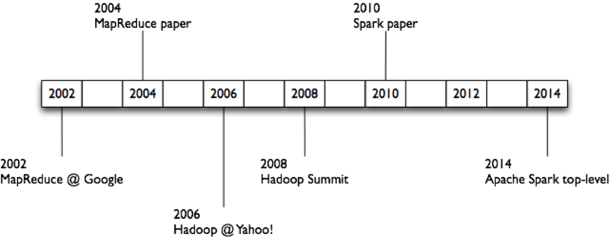

# [Data Science and Engineering with Apache Spark - edX - BerkeleyX](https://www.edx.org/xseries/data-science-engineering-apache-spark)
- [Introduction to Apache Spark](https://courses.edx.org/courses/course-v1:BerkeleyX+CS105x+1T2016/info)

## History

- 1956-1979: Stanford, MIT, CMU, and other universities develop set/list operations in LISP, Prolog, and other languages for parallel processing (see [http://www-formal.stanford.edu/jmc/history/lisp/lisp.html](http://www-formal.stanford.edu/jmc/history/lisp/lisp.html)).
- Circa 2004: [Google: MapReduce: Simplified Data Processing on Large Clusters](http://research.google.com/archive/mapreduce.html) by Jeffrey Dean and Sanjay Ghemawat
- Circa 2006: [Apache Hadoop](http://research.yahoo.com/files/cutting.pdf), originating from the Yahoo!’s Nutch Project Doug Cutting
- Circa 2008: [Yahoo! web scale search indexing](http://developer.yahoo.com/hadoop/) - Hadoop Summit, Hadoop User Group
- Circa 2009: Cloud computing with [Amazon Web Services Elastic MapReduce](http://aws.amazon.com/elasticmapreduce/) (AWS EMR), a Hadoop version modified for Amazon Elastic Cloud Computing (EC2) and Amazon Simple Storage System (S3), including support for Apache Hive and Pig.

## Apache Spark Research Papers

You can read more about Spark research here: [http://spark.apache.org/research.html](http://spark.apache.org/research.html)

- [Spark: Cluster Computing with Working Sets](http://people.csail.mit.edu/matei/papers/2010/hotcloud_spark.pdf), Matei Zaharia, Mosharaf Chowdhury, Michael J. Franklin, Scott Shenker, Ion Stoica. USENIX HotCloud (2010).
- [Resilient Distributed Datasets: A Fault-Tolerant Abstraction for In-Memory Cluster Computing](http://usenix.org/system/files/conference/nsdi12/nsdi12-final138.pdf), Matei Zaharia, Mosharaf Chowdhury, Tathagata Das, Ankur Dave, Justin Ma, Murphy McCauley, Michael J. Franklin, Scott Shenker, Ion Stoica. NSDI (2012)
- [Spark SQL: Relational Data Processing in Spark](https://amplab.cs.berkeley.edu/wp-content/uploads/2015/03/SparkSQLSigmod2015.pdf), Michael Armbrust, Reynold S. Xin, Cheng Lian, Yin Huai, Davies Liu, Joseph K. Bradley, Xiangrui Meng, Tomer Kaftan, Michael J. Franklin, Ali Ghodsi, Matei Zaharia. SIGMOD 2015. June 2015.

## Other Links
- [Piazza discussion group (use access code: cs1051x)](https://piazza.com/edx_berkeley/summer2016/cs1051x)
- [Apache Spark on Databricks for Data Engineers (Scala)](https://databricks-prod-cloudfront.cloud.databricks.com/public/4027ec902e239c93eaaa8714f173bcfc/346304/2168141618055109/484361/latest.html)
- [pache Spark on Databricks for Data Scientists (Scala)](https://databricks-prod-cloudfront.cloud.databricks.com/public/4027ec902e239c93eaaa8714f173bcfc/346304/2168141618055194/484361/latest.html)
- [http://spark.meetup.com/ ](http://spark.meetup.com/)
- [http://spark.apache.org/community.html](http://spark.apache.org/community.html)
- [http://databricks.com/blog/2014/11/05/spark-officially-sets-a-new-record-in-large-scale-sorting.html](http://databricks.com/blog/2014/11/05/spark-officially-sets-a-new-record-in-large-scale-sorting.html)
- [http://hortonworks.com/blog/category/spark/](http://hortonworks.com/blog/category/spark/)
- [http://spark-packages.org/](http://spark-packages.org/)
- [http://www.spark.tc/blog/](http://www.spark.tc/blog/)
- [https://spark.apache.org/docs/latest/](https://spark.apache.org/docs/latest/)
- [http://research.google.com/archive/mapreduce.html](http://research.google.com/archive/mapreduce.html)
- [https://forums.databricks.com/](https://forums.databricks.com/)
- [http://blog.cloudera.com/blog/category/spark/](http://blog.cloudera.com/blog/category/spark/)
- [http://ita.ee.lbl.gov/html/contrib/NASA-HTTP.html](http://ita.ee.lbl.gov/html/contrib/NASA-HTTP.html)
- [https://github.com/apache/spark/](https://github.com/apache/spark/)
- [http://www.jcmit.com/mem2014.htm](http://www.jcmit.com/mem2014.htm)
- [https://databricks.com/blog/category/engineering](https://databricks.com/blog/category/engineering)
- [https://amplab.cs.berkeley.edu/wp-content/uploads/2015/03/SparkSQLSigmod2015.pdf](https://amplab.cs.berkeley.edu/wp-content/uploads/2015/03/SparkSQLSigmod2015.pdf)
- [http://www.cs.berkeley.edu/~matei/papers/2012/nsdi_spark.pdf](http://www.cs.berkeley.edu/~matei/papers/2012/nsdi_spark.pdf)
- [http://www.cs.berkeley.edu/~matei/papers/2010/hotcloud_spark.pdf](http://www.cs.berkeley.edu/~matei/papers/2010/hotcloud_spark.pdf)
- [https://en.wikipedia.org/wiki/SQL](https://en.wikipedia.org/wiki/SQL)
- [http://sqlzoo.net/](http://sqlzoo.net/)
- [http://www.w3schools.com/sql/](http://www.w3schools.com/sql/)
- [http://www.sql-tutorial.net/](http://www.sql-tutorial.net/)
- [https://www.1keydata.com/sql/sql.html](https://www.1keydata.com/sql/sql.html)
- [http://www.sqlcourse.com/intro.html](http://www.sqlcourse.com/intro.html)
- [http://quickbase.intuit.com/articles/ultimate-web-guide-to-sql-database-language](http://quickbase.intuit.com/articles/ultimate-web-guide-to-sql-database-language)
- [http://spark.apache.org/docs/latest/sql-programming-guide.html#compatibility-with-apache-hive](http://spark.apache.org/docs/latest/sql-programming-guide.html#compatibility-with-apache-hive)
- [https://en.wikipedia.org/wiki/Join_(SQL)](https://en.wikipedia.org/wiki/Join_(SQL))
- [https://blog.codinghorror.com/a-visual-explanation-of-sql-joins/](https://blog.codinghorror.com/a-visual-explanation-of-sql-joins/)
- [http://www.w3schools.com/sql/sql_join.asp](http://www.w3schools.com/sql/sql_join.asp)

